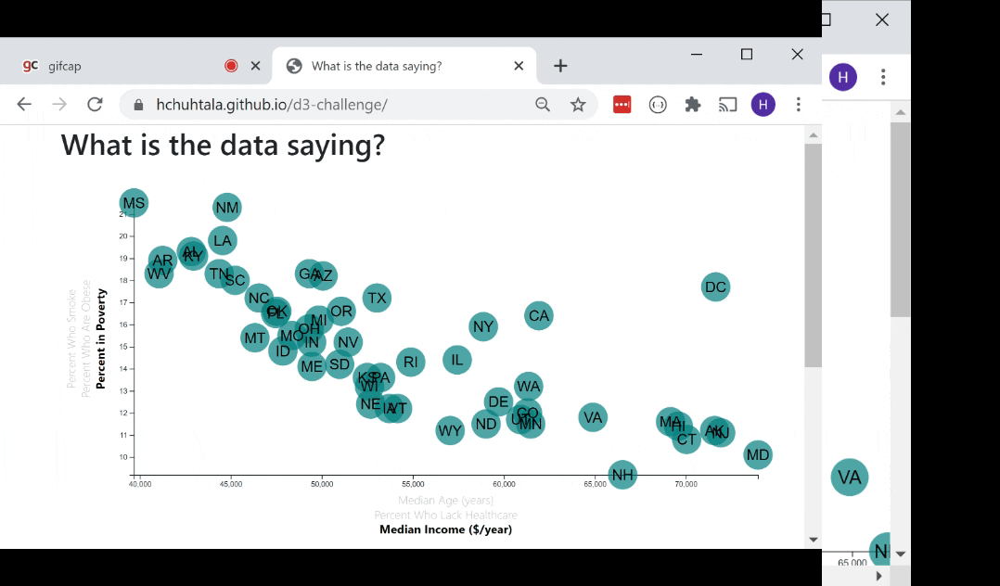

# d3-challenge
Explore the correlations betweenstation in life an health outcomes like obesity and smoking. The data was collected in 2014 for the [American Community Survey Data](https://www.census.gov/acs/www/data/data-tables-and-tools/data-profiles/2014/).

# Built With
* [d3](https://d3js.org/)
* [d3 tool tips](https://github.com/Caged)
